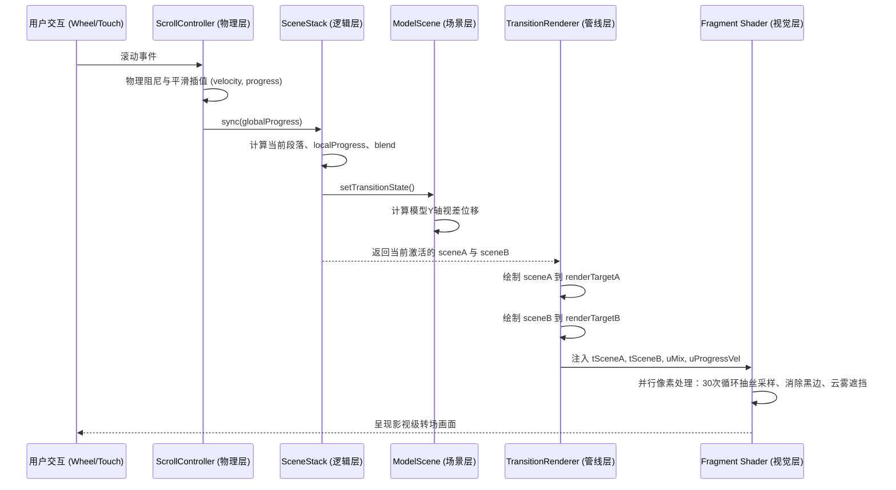

# FT 3D WebGL 引擎架构与过渡系统深度解析 (Ultra-Detailed)

本文档旨在**深度剖析**项目中 3D 场景滚动过渡（Scene Transition）的底层架构与工作原理。这是一套为高端企业级 3D 官方网站打造的渲染架构，核心目标是在保证 60FPS 性能的前提下，实现影视级的复杂流体色散转场。

整个大满贯系统按数据流转顺序分为四个核心模块：**物理输入层**、**逻辑状态层**、**管线渲染层**以及**着色器视觉层**。

---

## 1. 核心架构与数据流图 (Data Flow)

整个应用的更新循环（Game Loop）遵循单向数据流。通过下面的流程图可以清晰看到一帧画面是如何从鼠标滚轮变为屏幕特效的：



---

## 2. 模块解析一：物理控制层 (`ScrollController.ts`)

负责将生硬的系统原生滚动，转化为带有物理惯性的丝滑数据。
*   **Target Progress vs Actual Progress**：用户滚动时修改的是 `targetProgress`。实际的 `progress` 会在每一帧利用弹簧阻尼算法（Damping）平滑地向目标值逼近。
*   **计算速度 (`velocity`)**：通过两帧之间 `progress` 的差值推导出滚动速度。这个速度极度重要，它将被直接传递给 Shader（作为 `uProgressVel`），实现**“滚得越快，画面拖影拉丝越长”**的沉浸式力学反馈。

---

## 3. 模块解析二：状态机与进度切片 (`SceneStack.ts`)

如果一共有 N 个场景，传统的做法是一次性把 N 个场景都扔进引擎，这会导致 Draw Call 爆炸。`SceneStack` 是这套架构的性能保护伞。

### 3.1 进度切片算法
全局 `progress` 是 `0.0 ~ 1.0`。如果 N=4，则有 3 个“段（Segment）”。
```typescript
const scaled = clamped * segments;           // 比如进度 0.4 * 3 = 1.2
const currentIndex = Math.floor(scaled);     // 1，当前在 Scene 1
const localProgress = scaled - currentIndex; // 0.2，Scene 1 内的局部进度
```

### 3.2 延迟触发机制（Thresholding）
在段内的前 70% 滚动，不会发生转场（`blend = 0`）。这留给了用户纯净的浏览时间。
当 `localProgress > 0.7`（`transitionStart`）时，`blend` 值才开始从 0 迅速飙升到 1。
```typescript
// 混合系数计算公式
blend = (localProgress - 0.7) / (1.0 - 0.7); 
```

### 3.3 按需激活 (Culling)
严格执行“非相关即销毁”的原则。除了 `sceneA` 和 `sceneB` 处于活跃状态，其余所有场景的遍历和渲染完全停止。内存驻留但 GPU 不运算。

---

## 4. 模块解析三：场景内视差引擎 (`ModelScene.ts`)

2D 网页经典的视差（Parallax）被升维到了 3D 空间。
引擎每一帧都会向场景广播当前的 `blend` 状态。为了让转场有强烈的空间纵深感：
*   **Current 场景（正在退出）**：随着 `blend` 增加，模型 Y 坐标被强制往上推 `y = blend * distance`。
*   **Next 场景（正在进入）**：随着 `blend` 增加，模型 Y 坐标从下方往中心复位 `y = (1.0 - blend) * -distance`。

由于模型本身在滑动，背景也在着色器里拉丝，这种**逻辑层位移 + 视觉层拖尾**的复合效果，远超单纯的 Shader 动画。

---

## 5. 模块解析四：双离屏渲染管线 (`TransitionRenderer.ts`)

这里是“黑魔法”的集散地。为了让 A 场景和 B 场景能产生像素级的化学反应，我们必须使用 Render Targets (FBO)。

1.  引擎将 `sceneA` 和 `sceneB` 分别渲染到内存中的两块显存贴图 `renderTargetA` 和 `renderTargetB` 上。
2.  创建一个完全贴合屏幕的正交相机平面 (`PlaneGeometry(2, 2)`)。
3.  将刚刚拍下来的两张照片，作为材质变量（`uniform sampler2D tSceneA`, `tSceneB`）传给终极合成器 `compositeMaterial`。

---

## 6. 模块解析五：视觉合成着色器 (`composite.frag.glsl`)

这是全站最具技术含量的几百行代码。普通页面的淡入淡出是 CSS 的 `opacity` 动画，而我们是基于微积分和物理光学的像素重组。

### 6.1 时间轴非线性化 (`peak`)
```glsl
float progress = smoothstep(0.0, 1.0, uMix); // 消除硬拐点
float peak = sin(progress * PI);             // 提取抛物线高潮
```
所有最夸张的破坏性特效（亮度泛白、形变），均与 `peak` 挂钩。保证了不管怎么滚，首尾永远是原图，只有中间才狂暴。

### 6.2 积分采样消除重影 (Continuous Sampling)
老版本采用离散的 6 点采样，会导致“重影 (Ghosting)”。我们改为了影视级 30 次循环积分：
```glsl
for (int i = 0; i < SAMPLES; i++) {
    // 引入伪随机白噪声进行空间抖动 (Dithering)
    float t = (float(i) + dither) / float(SAMPLES);
    // ... 
}
```
通过随机数打散固定的采样间隔，视觉系统会把带有噪点的图像脑补成完美的连续流体。

### 6.3 色差分离 (Chromatic Aberration)
在拖尾的轨迹上，人为制造 RGB 三原色折射率的差异：
*   `t=0` (头部)：原色。
*   `t=0.5` (中部)：剥离出高饱和度的绿色。
*   `t=1.0` (尾部)：剥离出冰蓝色。
营造出模型以极高速度撕裂时产生的光谱发散。

### 6.4 预乘 Alpha (Pre-multiplied Alpha) 解决黑边
由于地球背景是透明的，在积分累加颜色时，透明像素默认 RGB 为 `(0,0,0)`。如果直接相加，会导致边缘积累出一圈极其难看的黑晕。
**核心解法：**
```glsl
// 累加时将颜色与该点自身的透明度相乘
accumRGB += samp.rgb * samp.a * tint; 
```
只有确切包含实体颜色的像素才参与发光运算，彻底杜绝黑边穿帮。

---

## 7. 架构优势总结

这种重型架构带来的收益是巨大的：
1.  **极高的扩展性**：未来只需写一个新的 `Scene` 类，只要实现 `SceneBase` 接口，就可以无缝插入全站滚动流，无需修改任何转场逻辑。
2.  **电影级质感**：双路离屏带来的像素掌控权，让前端工程师具备了媲美 After Effects 的合成能力。
3.  **精确的力学反馈**：用户的“手感”通过速度变量直接驱动了 GPU 的模糊半径，达到了所见即所得的人机合一体验。
